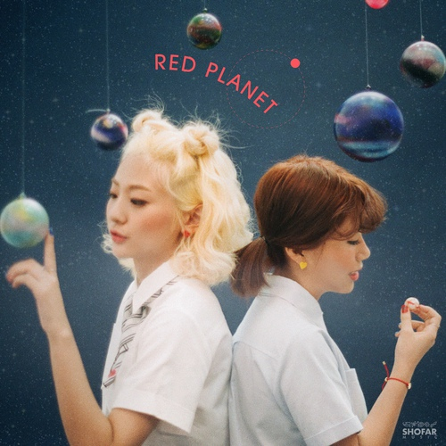
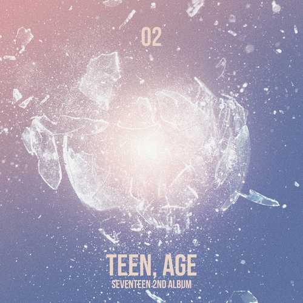

<html>
<head>
    <title>신파랑은 이런 노래 듣는다더라 Playlist</title>
    <meta charset="utf-8">
</head>
<body>
    <nav>
        <h1>Playlist</h1>
        <ul>
          <li><a href="#1">고강동</a></li>
          <li><a href="#2">꽃이 피는 걸 막을 순 없어요</a></li>
          <li><a href="#3">눈을 맞춰 술잔을 채워</a></li>
          <li><a href="#4">달</a></li>
          <li><a href="#5">떠내려가</a></li>
          <li><a href="#6">무언의 꽃(꽃은 말이 없다)</a></li>
          <li><a href="#7">바보</a></li>
          <li><a href="#8">소식</a></li>
          <li><a href="#9">쓰레기봉투의 재고를 점검하자</a></li>
          <li><a href="#10">위성에게</a></li>
          <li><a href="#11">지구에서 네가 제일 좋아</a></li>
          <li><a href="#12">채널-Non</a></li>
          <li><a href="#13">켜줘(Light)</a></li>
          <li><a href="#14">틈(闖)</a></li>
          <li><a href="#15">프리지아</a></li>
          <li><a href="#16">한 발짝 두 발짝</a></li>
          <li><a href="#17">Ai(愛)</a></li>
          <li><a href="#18">Juliet</a></li>
          <li><a href="#19">LIAR LIAR</a></li>
          <li><a href="#20">Lovely Icecream Princess Sweetie</a></li>
          <li><a href="#21">Re:pray</a></li>
          <li><a href="#22">Song Of The Sea</a></li>
          <li><a href="#23">TRAUMA</a></li>
          <li><a href="#24">Wanna Be(My Baby)</a></li>
          <li><a href="#25">You Never Know</a></li>
        </ul>
    </nav>
    <main>
        <h2>음악 미리보기</h2>
        <h3 id="1">고강동</h3>
        <h4>박소은</h4>
        
        
나는 아주아주 돈을 많이 벌어서 고강동을 통째로 다 사버릴 거야. 할아버지, 할머니가 거기 살거든 서울 의원도 마트도 당신들 거예요.

        <h3 id="2">꽃이 피는 걸 막을 순 없어요</h3>
        <h4>선우정아</h4>
        
        
내 맘을 누가 알까요. 혼자서도 꽃은 피어요. 햇빛이 들지 않아도 차가운 벽돌을 뚫고 들꽃은 피어버리죠. 어떻게 내 마음을 막겠어요. 아무 일 없이 피어버린 내 잘못인가요?

        <h3 id="3">눈을 맞춰 술잔을 채워</h3>
        <h4>박소은</h4>
        
        
뭐가 어때. 나는 어리고 또 자유로운 건데. 나쁜거니? 그런 기준은 어디서 배워 온 거니. 뭐가 어때. 나는 취할거고 사랑도 할 건데. 못된거면 욕이라도 해줘. 넌 그런 게 귀여우니.

        <h3 id="4">달</h3>
        <h4>박영준(feat.김다영)</h4>
        
        
하늘에 뜬 저 광명체, 홀로 차갑게 밤길 비추네. 나그네 외로운 밤길 고요하게 말동무 되어주네.

        <h3 id="5">떠내려가</h3>
        <h4>세븐틴</h4>
        
        
시간은 흘러가. 길게만 느껴졌던 내 하루를 돌아봐. 짧기만 한데 그때는 몰랐었지. 그냥 지나쳤던 것들. 오늘따라 더 보고만 싶어지는 되돌릴 수 없는 아름다운 기억들.

        <h3 id="6">무언의 꽃(꽃은 말이 없다)</h3>
        <h4>화려(Hwaryeo)</h4>
        
        
잡히지 않는 별처럼 당신도 그러하네. 땅 위를 걷는 그대도 속을 알 수가 없네. 아무말도 못하고 꽃밭을 느릿느릿 걸어요. 꽃밭을 느릿느릿 걸어요.

        <h3 id="7">바보</h3>
        <h4>에픽하이(EPIK HIGH)(feat.Bumkey)</h4>
        
        
오늘도 난 바보처럼 아무말도 못해 이 제자리에 서있죠. 사랑한단 말도 아무말 못하고 난 그대로 멈춰있죠. 오늘도 난 바보처럼 다가가지 못해 이 제자리에 서있죠. 사랑이란 말, 그 흔한 말도 못하는 바보. 바보. 바보.

        <h3 id="8">소식</h3>
        <h4>안예은</h4>
        
        
반갑구나. 바다 가르고 하늘 너머 날아온 숨. 또 다른 시작을 하게 될 그곳에서 기다리네. 작별의 눈물을 흘렸나, 홀가분한 소태를 지었나, 풍운을 그리고 있는가. 즐거웁게 춤을 추자.

        <h3 id="9">쓰레기봉투의 재고를 점검하자(Raon Lee Ver.)</h3>
        <h4>Raon Lee</h4>
        
        
손님이 떠나간 한밤의 카페 마감은 5분 전 상쾌한 기분. 때마침 매장에 걸려온 전화 엄근진 사장님, "구석의 쓰레기를 버려."

        <h3 id="10">위성에게</h3>
        <h4>박소은</h4>
        
        
너의 모습이 가짜라도 좋아. 아무것도 없는 어두운 하늘 위로 너는 언제나 곁을 지키잖아. 너의 모습이 허상이여도 돼. 혼자 남은 새벽 두려워 웅크리면 네가 언제나 나를 지키잖아.

        <h3 id="11">지구에서 네가 제일 좋아</h3>
        <h4>오곤(feat.제이미 of 더 러쉬)</h4>
        
        
어쩌면 내 세상엔 너뿐인가 봐. 나를 이룬 모든 게 당연하듯 널 향해. 별다를 거 없는 네 행동 하나하나도 나에게는 빛나는 기적일지 몰라.

        <h3 id="12">채널-Non</h3>
        <h4>체리 필터</h4>
        
        
저 시큼한 숨결 너머 붉은 선혈 수놓은 들판에 흐느낀 죽은 가지만이 자라는 나무, 또 태양조차 질겁하는 어둠의 그 끝에 맘을 가두고 싶었는데.

        <h3 id="13">켜줘(Light)</h3>
        <h4>Wanna One(워너원)</h4>
        
        
이불처럼 나를 덮어. 끝이 없는 기쁨을 가져. 너의 입술이 가까울 때 심장이 자꾸 멎을듯해. 어쩐지 오늘 너를 볼 때 나, 익숙함보단 설레임이 더 커.

        <h3 id="14">틈(闖)</h3>
        <h4>체리 필터</h4>
        
        
언젠가 이 틈이 사라질까. 우리의 말은 너무 공허하고 서로를 마주하면서도 서로에게 버려진 우린.

        <h3 id="15">프리지아</h3>
        <h4>볼빨간사춘기</h4>
        
        
프리지아 꽃은 아직 피지 않아도 그대의 향기는 아직 내게 남아요. 햇살 밝은 날 그대와 다시 만나면 그땐 내게 그 꽃을 선물해주세요.

        <h3 id="16">한 발짝 두 발짝</h3>
        <h4>오마이걸(OH MY GIRL)</h4>
        
        
날씨가 너무 좋아 상상하죠. 그대와 손을 잡고 눈을 마주하고. 한숨도 못 잤죠. 나 병인가 봐요. 맞아요. 내가, 내가, 너를, 너를 좋아해.

        <h3 id="17">Ai(愛)</h3>
        <h4>Otsuka Ai(大塚 愛)</h4>
        
        
温もりに甘んじて忘れていた 深く深く眠っていた本当の気持ち 纏わされないでもっと素晴らしい事がある 纏わされないでもっと想える事がある

        <h3 id="18">Juliet</h3>
        <h4>LMNT</h4>
        
        
Hey I've been watching you Every little thing you do Every time I see you pass In my homeroom class makes my heart beat fast

        <h3 id="19">LIAR LIAR</h3>
        <h4>오마이걸(OH MY GIRL)</h4>
        
        
밤새 난 이불을 뒤척뒤척 상상의 바다를 첨벙첨벙 Liar liar liar, oh 말도 안돼 Liar liar liar, oh oh

        <h3 id="20">Lovely Icecream Princess Sweetie</h3>
        <h4>EGOIST</h4>
        
        
You already crazy for me 少し憧れるあの唇忘れらんない うるうるしててキュート ちょっとあつぼったいのがいいの

        <h3 id="21">Re:pray</h3>
        <h4>Aimer</h4>
        
        
歩道橋階段雨音手を振るよ最後の背中に 青に変わるライトで時が動く傘の波飲み込んだ my days

        <h3 id="22">Song Of The Sea</h3>
        <h4>Lisa Hannigan</h4>
        
        
Between the here between the now Between the north between the south Between the west between the east Between the time between the place

        <h3 id="23">TRAUMA</h3>
        <h4>세븐틴</h4>
        
        
I'm in trauma it's got me singing Stuck in trauma 노래나 부를래 Blah blah blah blah 안 잊혀져 왜 This my trauma yeah my trauma

        <h3 id="24">Wanna Be(My Baby)</h3>
        <h4>Wanna One(워너원)</h4>
        
        
이런 느낌 처음인 걸. 혹시 이게 사랑일까? 뭐든지 다 해주고 싶어. 네가 원하는 거 말이야. 마음 깊숙이 들어가서 남김없이 다 알고 싶어. 너만 아는 콤플렉스까지도.

        <h3 id="25">You Never Know</h3>
        <h4>클래지콰이</h4>
        
        
Never gonna say that I been calling you tonight 어디 있는 거야 지금 넌 밤이 새도록 너를 찾지만 But you're never here

    </main>
</body>
</html>
